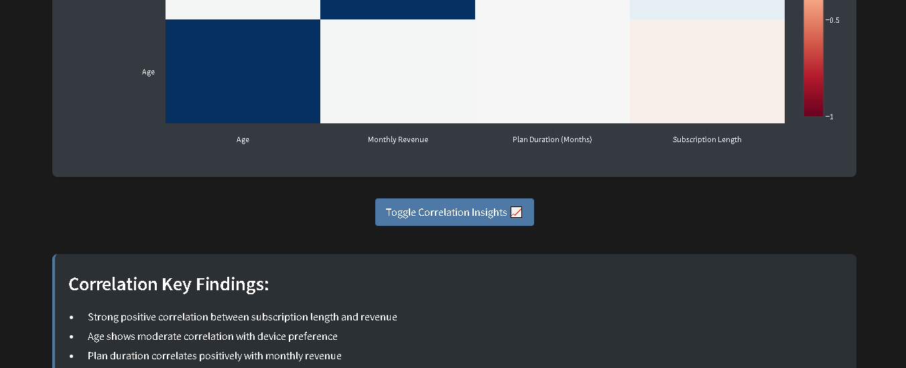

# Jio Cinema User Analysis Dashboard 🎬

## 🚀 The Future of AI: Moving Towards Agentic Intelligence

AI is evolving beyond simple automation. With advancements in **Agentic AI**, tools like **Replit Agent** can autonomously generate entire projects with minimal human intervention. As **Jensen Huang** (CEO of NVIDIA) emphasized, AI is transitioning from "copilots" to "autonomous agents" that understand context, make decisions, and generate solutions independently.

This project is a step towards that vision — it was entirely built by **Replit Agent**, demonstrating how AI can create fully functional applications from scratch.

---

## 📊 About This Project
This is a **Streamlit-based data analysis and visualization dashboard** for analyzing Jio Cinema's user data. It provides **interactive insights** into user demographics, revenue trends, and subscription patterns.

## ✨ Features
- 📊 **Interactive data visualizations** (bar, pie, heatmap, etc.)
- 👥 **User demographics analysis** (age, gender, region)
- 💰 **Revenue insights** (subscription-based breakdowns)
- 🌍 **Geographic distribution analysis**
- 🔄 **Subscription pattern trends**
- 📈 **Correlation analysis with heatmaps**
- 🎨 **Dark theme UI with a responsive design**

## 🛠 Tech Stack
- **Python 3.x**
- **Streamlit**
- **Pandas**
- **Plotly**
- **NumPy**

## 📂 Project Structure
```
├── .streamlit/
│   ├── config.toml
│   └── style.css
├── attached_assets/
│   └── jio_cinema_users_extended.csv
├── utils/
│   ├── data_processor.py
│   └── visualizations.py
└── main.py
```

## 📥 Dataset Source
This project uses a **real-world dataset** from **Kaggle**:  
[Jio Cinema Userbase Dataset](https://www.kaggle.com/datasets/nitingoyal8/jio-cinema-userbase-dataset?resource=download)  
**Dataset File:** `jio_cinema_users_extended.csv`

## 🚀 Setup Instructions
1. Clone the repository:
   ```bash
   git clone https://github.com/vsumitwork/JioCinema-Analytics-AI-Generated.git
   ```
2. Navigate into the project directory:
   ```bash
   cd JioCinemaAnalytics
   ```
3. Install dependencies:
   ```bash
   pip install -r requirements.txt
   ```
4. Run the Streamlit app:
   ```bash
   streamlit run main.py
   ```
   When you run this command, the URL displayed may look like this:  
   `URL: http://0.0.0.0:5000`  
   Change it to `http://127.0.0.1:5000/`, and the app will run perfectly.

## Usage

The dashboard provides various interactive features:
- Toggle between bar and pie charts for age distribution
- Filter device distribution by subscription type
- View detailed insights for each analysis section
- Interactive geographic visualization
- Correlation analysis with heatmap

## 🎥 Project Demo

**Dashboard Screenshots:**  
Explore the [`Dashboard`](Dashboard/) folder for screenshots showcasing the interactive design and visual elements of the application.
Below is a snapshot of the dashboard:




**Video Preview:**  
Watch the [**video preview**](preview.mp4) to see the AI-generated project in action!

## 🤖 AI Contribution: Built by Replit Agent
This project was **100% generated by Replit Agent**, showcasing how AI can:
- Generate full-fledged applications
- Write structured and optimized code
- Automate the development process

The future of AI development is here. As **Agentic AI** evolves, tools like this will become even more powerful, shaping the next era of software development. 🚀

## 📜 License
MIT License

